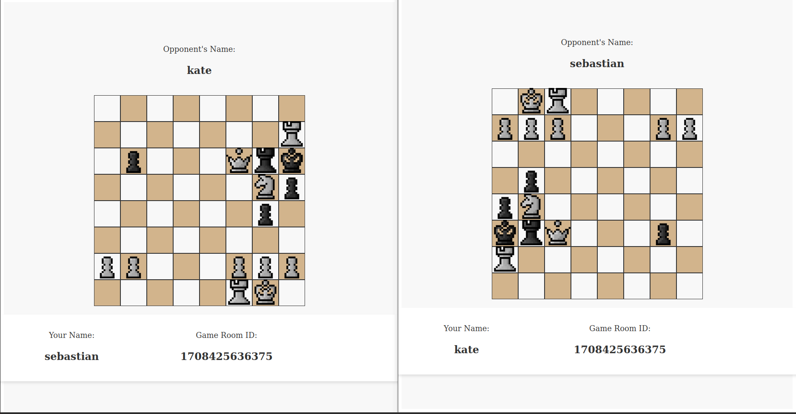

# chess_webApp_multiplayer
a multiplayer chess web app

## This is a multiplayer Chess game 

[Game](/picture/chess_game.png)

## Usage

run in the 'chess_fronted':

`npm install` then `npm run serve`

run in the 'chess_server':

`npm install` then `npm run build` `npm run start`